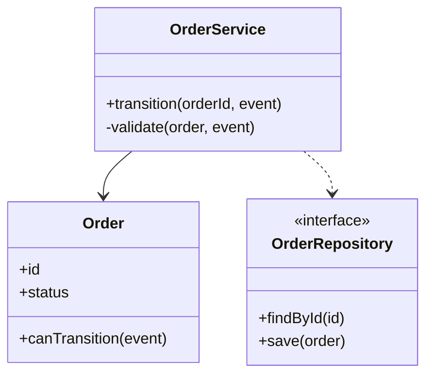

# 訂單狀態轉換 類別圖

## 類別設計

## 設計說明

- `OrderService`：負責協調訂單狀態轉換，只做流程控制，轉換規則放在 `Order`；對 `OrderRepository` 用依賴，因為只在方法執行時才使用它。
- `Order`：持有狀態與轉換規則 `canTransition`；`OrderService` 對它用關聯，因為兩者是長期協作的對象。
- `OrderRepository`：設計成介面，讓 `OrderService` 不依賴具體儲存方式，測試時可替換。
