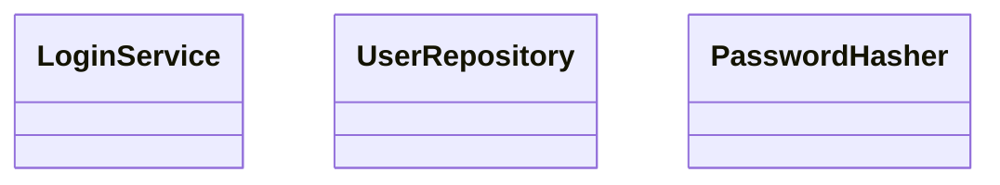

# Rule 1 - 骨架整份就是產出檔，不寫使用說明

- 強度：必須
- 骨架從第一行到最後一行都是產出檔的內容，複製後就是產出檔的雛形。
- 不在開頭或結尾加「本樣板用於…」「請依下列方式填寫」等使用說明；什麼時候用、怎麼用，寫在 SOP 與 RuleFile。
- 骨架裡唯一的註解，是佔位符判準規定的「依此類推」。

## Good Example

- 第一行就是產出檔的標題，複製後只要換掉佔位符。

````markdown
# {{功能名稱}} 類別圖

```mermaid
classDiagram
  class {{類別名稱 1}}
  class {{類別名稱 2}}
  %% 依此類推
```

## 類別職責

- `{{類別名稱 1}}`：{{類別 1 職責}}
- `{{類別名稱 2}}`：{{類別 2 職責}}
<!-- 依此類推 -->
````

## Bad Example

- 同一份骨架開頭多了使用說明，複製後這段說明也跟著進了 `docs/design/會員登入-class-diagram.md`。

````markdown
> 本樣板供 plan-with-class-diagram Phase 2 步驟 2 使用，請將 {{…}} 換成實際內容。

# {{功能名稱}} 類別圖

```mermaid
classDiagram
  class {{類別名稱 1}}
  class {{類別名稱 2}}
  %% 依此類推
```

## 類別職責

- `{{類別名稱 1}}`：{{類別 1 職責}}
- `{{類別名稱 2}}`：{{類別 2 職責}}
<!-- 依此類推 -->
````

# Rule 2 - 範例逐段對應骨架

- 強度：必須
- 範例的段落、順序與固定文字和骨架相同；把範例填入的值換回佔位符，就會得到骨架。
- 重複區塊在範例中依實際需要展開成任意組數，不限兩組。

## Good Example

- 對應 Rule 1 Good 的骨架，範例的段落與固定文字都一樣；類別展開成三組，仍然逐段對得上。

````markdown
# 會員登入 類別圖



## 類別職責

- `LoginService`：驗證帳號密碼並回傳登入結果
- `UserRepository`：依帳號讀取會員資料
- `PasswordHasher`：比對密碼與雜湊值
````

## Bad Example

- 同一份範例多了骨架沒有的 `## 設計考量`，段落名稱也從 `類別職責` 改成 `職責說明`。照範例產出的檔案和骨架不一致，換回佔位符也得不到骨架。

````markdown
# 會員登入 類別圖


## 職責說明

- `LoginService`：驗證帳號密碼並回傳登入結果
- `UserRepository`：依帳號讀取會員資料
- `PasswordHasher`：比對密碼與雜湊值

## 設計考量

- 密碼比對獨立成 PasswordHasher，方便替換演算法。
````

# Rule 3 - 範例是填好的完整成品

- 強度：必須
- 範例裡不留任何 `{{…}}` 佔位符，也不留「依此類推」註解。
- 名稱、數值、文字都填真實可用的值。

## Good Example

- 每個佔位符都填上了具體的類別名稱與職責，註解也已拿掉，看得出成品長什麼樣子。

```markdown
## 類別職責

- `LoginService`：驗證帳號密碼並回傳登入結果
- `UserRepository`：依帳號讀取會員資料
```

## Bad Example

- 同一段範例還留著佔位符與註解，和骨架沒有差別，看不出該填成什麼樣子。

```markdown
## 類別職責

- `LoginService`：{{類別 1 職責}}
- `UserRepository`：依帳號讀取會員資料
<!-- 依此類推 -->
```

# Rule 4 - 範例優先取用目標 skill 的真實產出

- 強度：建議
- 目標 skill 已經產出過該檔案時，範例從真實產出取材，不自行編造。
- 沒有真實產出時，才依目標 skill 的領域編一份具體的範例。

## Good Example

- `plan-with-class-diagram` 已實際產出過 `docs/design/會員登入-class-diagram.md`，範例直接取用其中的類別與職責。

```markdown
- `LoginService`：驗證帳號密碼並回傳登入結果
- `UserRepository`：依帳號讀取會員資料
```

## Bad Example

- 同樣已有真實產出，範例卻自編了 `Foo`、`Bar`，看不出這個 skill 實際會畫出什麼樣的類別。

```markdown
- `Foo`：處理 Foo 相關邏輯
- `Bar`：處理 Bar 相關邏輯
```
